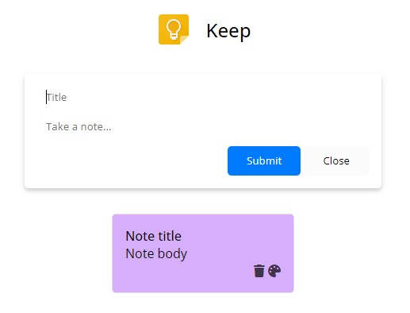

# Google Keep Clone

Clone of Google's app to take notes. Made with vanilla JavaScript, HTML and SCSS.

## Preview

## Project walkthrough

1. Click on the title input box to add a note.
1. Type a note title or body or both.
1. Click on Submit or outside the box to create a note. Or click on Close to hide the add note option.
1. To modify the content of a created note just click on it and an option to change the title or body will get displayed.
1. The note can be deleted and its background color can be modified.
1. Notes will be saved to local storage.
